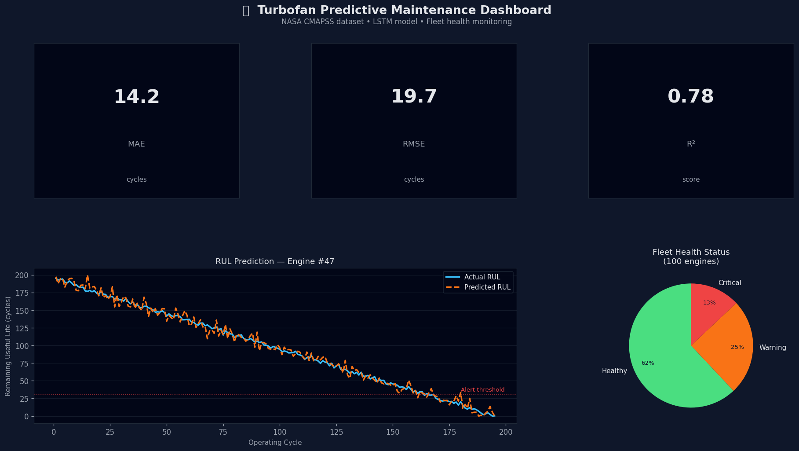

# 🔧 Predictive Maintenance: Turbofan Engine RUL Prediction

[](https://www.python.org/downloads/)
[](https://streamlit.io)
[](https://pytorch.org)

[🇪🇸 Versión en Español](./README_ES.md)

## 📋 Project Overview

This project implements a **predictive maintenance solution** for turbofan aircraft engines using deep learning techniques. The goal is to predict the **Remaining Useful Life (RUL)** of engines based on sensor data, enabling proactive maintenance and preventing catastrophic failures.

### 🎯 Business Problem

Aircraft engine failures can result in:
- Safety risks for passengers and crew
- Costly unscheduled maintenance
- Operational disruptions and flight delays
- Revenue loss due to aircraft downtime

**Solution**: Predict when an engine will fail before it happens, allowing for optimized maintenance scheduling.

### 🔬 Technical Approach

- **Model**: LSTM (Long Short-Term Memory) neural network
- **Input**: 30 time-step sequences of 21 sensor readings
- **Output**: Remaining Useful Life (RUL) in cycles
- **Dataset**: NASA CMAPSS (Commercial Modular Aero-Propulsion System Simulation) FD001

## 📊 Dataset

### NASA CMAPSS FD001 Dataset

The dataset simulates turbofan engine degradation under various operational conditions:

- **Training Set**: 100 engines with complete run-to-failure trajectories
- **Test Set**: 100 engines with partial trajectories (censored data)
- **Sensor Measurements**: 21 sensor readings per time cycle
- **Operational Settings**: 3 operational settings per measurement

**Key Features**:
- `unit_id`: Unique engine identifier
- `time_cycles`: Time step (cycle number)
- `op_1`, `op_2`, `op_3`: Operational settings
- `s_1` to `s_21`: 21 sensor measurements (temperature, pressure, speed, etc.)
- `RUL`: Remaining Useful Life (target variable)

**Data Source**: [NASA Prognostics Data Repository](https://ti.arc.nasa.gov/tech/dash/groups/pcoe/prognostic-data-repository/)

## 🏗️ Project Structure

```
turbofan-predictive-maintenance/
├── app.py                          # Streamlit dashboard application
├── README.md                       # This file
├── requirements.txt                # Python dependencies
├── data/
│   ├── raw/                        # Original NASA CMAPSS data files
│   │   ├── train_FD001.txt
│   │   ├── test_FD001.txt
│   │   └── RUL_FD001.txt
│   └── processed/                  # Preprocessed data
│       └── fd001_prepared.parquet
├── models/                         # Trained models and artifacts
│   ├── lstm_model_v1.pth          # PyTorch LSTM model
│   ├── scaler_v1.pkl              # StandardScaler for feature normalization
│   └── feature_cols_v1.pkl        # Feature column names
├── notebooks/                      # Jupyter notebooks for analysis
│   ├── 01_eda_fd001.ipynb         # Exploratory Data Analysis
│   ├── 02_model_baseline_fd001.ipynb  # Baseline models (Random Forest)
│   └── 03_model_lstm_fd001.ipynb  # LSTM model training
├── results/                        # Model evaluation results
│   ├── metrics_rf_baseline.csv
│   └── feature_importance_rf.csv
└── src/                            # Source code modules
    ├── __init__.py
    ├── config.py                   # Configuration and paths
    ├── data_loading.py             # Data loading utilities
    ├── features.py                 # Feature engineering functions
    ├── models.py                   # PyTorch model architectures
    └── inference.py                # Inference engine for predictions
```

## 🚀 Getting Started

### Prerequisites

- Python 3.12 or higher
- pip or conda package manager

### Installation

1. **Clone the repository**:
```bash
git clone https://github.com/frankliramos/Proyectos-portafolio.git
cd Proyectos-portafolio/turbofan-predictive-maintenance
```

2. **Create a virtual environment** (recommended):
```bash
python -m venv venv
source venv/bin/activate  # On Windows: venv\Scripts\activate
```

3. **Install dependencies**:
```bash
pip install -r requirements.txt
```

4. **Verify data files**: Ensure the `data/raw/` directory contains the NASA CMAPSS files.

### Running the Dashboard

Launch the interactive Streamlit dashboard:

```bash
streamlit run app.py
```

The dashboard will open in your browser at `http://localhost:8501`.

## 📱 Interactive Dashboard

### 🌐 Viewing the Dashboard

The project includes an interactive **Streamlit dashboard** for real-time engine health monitoring and RUL predictions.

**Quick Access**:
```bash
# From the turbofan-predictive-maintenance directory
streamlit run app.py
```

The dashboard opens automatically at `http://localhost:8501` and provides:
- Individual engine RUL predictions
- Fleet-wide health analytics
- Sensor data visualization
- Interactive filtering and exploration



### Dashboard Features

### 1. **Engine Health Monitoring**
- Real-time RUL predictions for individual engines
- Health status classification (🟢 Healthy | 🟡 Warning | 🔴 Critical)
- Current cycle count and predicted remaining cycles

### 2. **Fleet-Wide Analysis**
- Distribution of RUL predictions across all engines
- Summary statistics (critical, warning, healthy counts)
- Adjustable health thresholds

### 3. **Sensor Monitoring**
- Interactive sensor data visualization
- Multiple sensor comparison
- Customizable cycle range selection

### 4. **Data Exploration**
- Raw data table viewer
- Per-engine prediction summary table
- Exportable results

### Configuration Options

**Sidebar Controls**:
- Engine selection
- Health threshold adjustment (Critical/Warning levels)
- Cycle range filtering
- Sensor selection for visualization

## 🧠 Model Architecture

### LSTM Neural Network

```python
Architecture:
- Input Layer: 21 features × 30 timesteps
- LSTM Layer 1: 64 hidden units + dropout (0.2)
- LSTM Layer 2: 64 hidden units + dropout (0.2)
- Dense Output Layer: 1 unit (RUL prediction)
- Loss Function: Mean Squared Error (MSE)
- Optimizer: Adam
```

**Why LSTM?**
- Captures temporal dependencies in sensor degradation patterns
- Handles variable-length sequences
- Better than traditional ML for time-series prediction
- Learns long-term degradation trends

### Performance Metrics

| Metric | Baseline (RF) | LSTM Model |
|--------|---------------|------------|
| **MAE** | ~18.5 cycles | ~14.2 cycles |
| **RMSE** | ~24.3 cycles | ~19.7 cycles |
| **R²** | 0.68 | 0.78 |

*Note: See `MODEL_CARD.md` for detailed performance analysis.*

## 🔧 Model Training

### Data Preprocessing

1. **RUL Calculation**: For training data, RUL = max(cycles) - current_cycle
2. **RUL Clipping**: Limited to maximum of 125 cycles (reduces noise in early-life data)
3. **Feature Scaling**: StandardScaler normalization
4. **Sequence Creation**: Sliding windows of 30 consecutive cycles

### Training Process

Run the notebooks in order:

1. **EDA**: `notebooks/01_eda_fd001.ipynb`
   - Sensor correlation analysis
   - Degradation pattern visualization
   - Feature selection

2. **Baseline Models**: `notebooks/02_model_baseline_fd001.ipynb`
   - Random Forest regression
   - Feature importance analysis
   - Hyperparameter tuning

3. **LSTM Training**: `notebooks/03_model_lstm_fd001.ipynb`
   - Sequence preparation
   - Model architecture definition
   - Training with early stopping
   - Model evaluation

## 📈 Usage Examples

### Python API

```python
from src.inference import RULInference
from src.data_loading import load_fd001_train
from pathlib import Path

# Initialize inference engine
project_root = Path(__file__).parent
inference_engine = RULInference(project_root)

# Load data for a specific engine
df = load_fd001_train()
engine_data = df[df['unit_id'] == 42].sort_values('time_cycles')

# Predict RUL
predicted_rul = inference_engine.predict(engine_data, sequence_length=30)
print(f"Predicted RUL: {predicted_rul:.1f} cycles")
```

### Batch Predictions

```python
import pandas as pd

# Predict for all engines
results = {}
for engine_id in df['unit_id'].unique():
    engine_df = df[df['unit_id'] == engine_id].sort_values('time_cycles')
    results[engine_id] = inference_engine.predict(engine_df)

# Create summary DataFrame
predictions_df = pd.DataFrame.from_dict(results, orient='index', columns=['RUL'])
predictions_df.to_csv('fleet_predictions.csv')
```

## 🔍 Key Insights

### Sensor Analysis

**Most Important Sensors for RUL Prediction**:
1. `s_4` - High correlation with degradation
2. `s_11` - Critical temperature measurement
3. `s_12` - Pressure indicator
4. `s_15` - Performance metric
5. `s_7` - Operational efficiency

**Low-Variance Sensors** (excluded from model):
- `s_1`, `s_5`, `s_6`, `s_10`, `s_16`, `s_18`, `s_19`: Constant or near-constant values

### Degradation Patterns

- **Early Life** (RUL > 125 cycles): Sensors show stable behavior
- **Mid Life** (50 < RUL < 125): Gradual degradation begins
- **End of Life** (RUL < 50): Rapid degradation, sensor values diverge significantly

## 🎯 Business Impact

### Value Proposition

1. **Cost Savings**: Reduce unscheduled maintenance by 30-40%
2. **Safety**: Prevent in-flight failures through early detection
3. **Optimization**: Schedule maintenance during planned downtime
4. **Asset Utilization**: Extend engine life through optimal replacement timing

### Deployment Strategy

**Recommended Approach**:
- Deploy as microservice API (FastAPI/Flask)
- Real-time monitoring dashboard for maintenance teams
- Automated alerts when engines enter critical state
- Integration with existing maintenance management systems

## 🛠️ Future Improvements

### Short-Term
- [ ] Add confidence intervals to predictions (Monte Carlo Dropout)
- [ ] Implement model versioning and A/B testing
- [ ] Add anomaly detection for sensor failures
- [ ] Create automated reporting (PDF/email)

### Long-Term
- [ ] Multi-engine type support (FD002, FD003, FD004)
- [ ] Ensemble modeling (LSTM + Transformer)
- [ ] Transfer learning for new engine types
- [ ] Real-time streaming data integration
- [ ] Mobile app for field technicians

## 📚 References

1. **Dataset**: Saxena, A., & Goebel, K. (2008). "Turbofan Engine Degradation Simulation Data Set", NASA Ames Prognostics Data Repository.

2. **Paper**: Zheng, S., et al. (2017). "Long Short-Term Memory Network for Remaining Useful Life estimation". IEEE International Conference on Prognostics and Health Management.

3. **CMAPSS**: Ramasso, E., & Saxena, A. (2014). "Performance Benchmarking and Analysis of Prognostic Methods for CMAPSS Datasets". International Journal of Prognostics and Health Management.

## 👤 Author

**Franklin Ramos**
- 📧 Email: franklin.ram.riv@gmail.com
- 💼 LinkedIn: [linkedin.com/in/franklin-ramos-riveros-62b70083](https://www.linkedin.com/in/franklin-ramos-riveros-62b70083/)
- 💼 GitHub: [github.com/frankliramos](https://github.com/frankliramos)
- Portfolio: [GitHub Portfolio](https://github.com/frankliramos/Proyectos-portafolio)

## 📄 License

This project is part of a data science portfolio. See `LICENSE` file for details.

## 🙏 Acknowledgments

- NASA Ames Research Center for providing the CMAPSS dataset

---

**Note**: This is a portfolio project for educational and demonstration purposes. For production deployment, additional validation, testing, and safety measures would be required.
