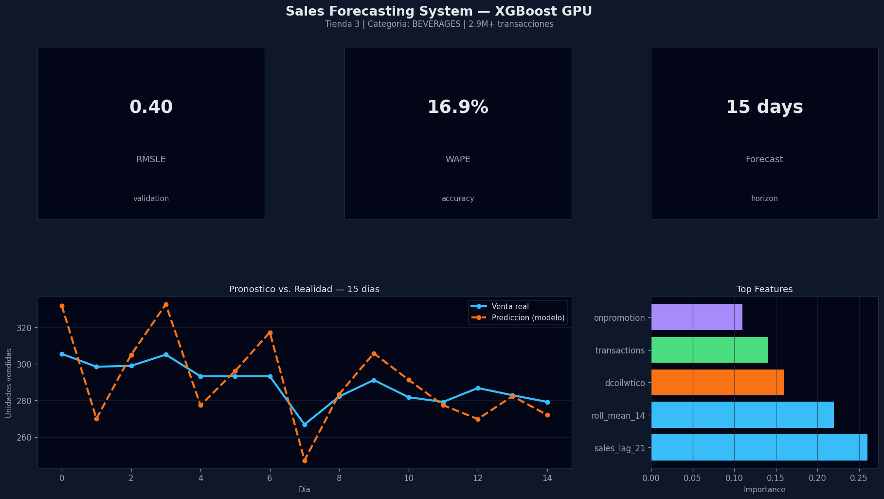

# 📈 Sistema de Pronóstico de Ventas: Predicción de Demanda Minorista

[](https://www.python.org/downloads/)
[](https://streamlit.io)
[](https://xgboost.readthedocs.io)

[🇬🇧 English Version](./README.md)

## 🇬🇧 English Summary

This project delivers a **retail sales forecasting system** for Ecuadorian stores.
It predicts daily sales 15 days ahead to optimize inventory and planning.

**Key points:**
- Model: XGBoost with GPU acceleration.
- Dataset: 2.9M+ records and 27 engineered features.
- Metrics: RMSLE ~0.40 and WAPE ~16.9%.

For full English details, see [README.md](./README.md).

## 📋 Resumen del Proyecto

Este proyecto implementa una **solución de pronóstico de ventas minoristas** para tiendas ecuatorianas utilizando aprendizaje automático. El sistema predice **ventas diarias unitarias** para los próximos 15 días a través de diferentes familias de productos y ubicaciones de tiendas, permitiendo una gestión de inventario optimizada y planificación de demanda.

### 🎯 Problema de Negocio

Los negocios minoristas enfrentan desafíos críticos en la gestión de inventario:
- **Quiebres de Stock**: Oportunidades de venta perdidas e insatisfacción del cliente
- **Sobrestock**: Capital inmovilizado, costos de almacenamiento y desperdicio de productos
- **Planificación Ineficiente**: Pronósticos pobres de demanda llevan a decisiones de compra subóptimas
- **Volatilidad Económica**: Factores externos (precios del petróleo, feriados) crean incertidumbre en la demanda

**Solución**: Predecir ventas futuras con alta precisión (84%) para optimizar niveles de inventario y reducir costos.

### 🔬 Enfoque Técnico

- **Modelo**: XGBoost con aceleración GPU
- **Métrica de Optimización**: RMSLE (Error Cuadrático Medio Logarítmico)
- **Características**: 27 features ingenierizadas incluyendo rezagos, medias móviles e indicadores externos
- **Horizonte de Pronóstico**: 15 días adelante
- **Tamaño del Dataset**: 2.9M+ registros de transacciones

## 📊 Dataset

### Datos de Ventas Minoristas (Ecuador)

El dataset contiene datos transaccionales de múltiples tiendas minoristas en Ecuador:

- **Período de Tiempo**: Datos históricos de ventas de múltiples años
- **Tiendas**: 54 ubicaciones de tiendas diferentes
- **Familias de Productos**: 33 categorías distintas de productos
- **Registros**: 2,947,428 muestras de entrenamiento

**Variables Clave**:
- `date`: Fecha de transacción
- `store_nbr`: Identificador de tienda (1-54)
- `family`: Categoría de producto (ej. BEVERAGES, GROCERY, PRODUCE)
- `sales`: Ventas unitarias (variable objetivo)
- `onpromotion`: Número de ítems en promoción
- `dcoilwtico`: Precio diario del petróleo (West Texas Intermediate)
- `transactions`: Conteo diario de transacciones de clientes

**Datos Externos**:
- **Precios del Petróleo**: La economía de Ecuador depende del petróleo, haciendo los precios un indicador económico clave
- **Feriados**: Feriados nacionales y locales que afectan patrones de compra
- **Metadata de Tiendas**: Ubicación (ciudad, estado), tipo de tienda, cluster

**Fuente de Datos**: Competencia de Kaggle Store Sales - Time Series Forecasting

## 🏗️ Estructura del Proyecto

```
Proyecto 2/
├── README.md                        # Este archivo (versión español)
├── README_ES.md                     # Versión en inglés
├── requirements                     # Dependencias de Python
├── dashboard/
│   └── app.py                       # Dashboard interactivo Streamlit
├── notebooks/
│   ├── 01_eda_ventas.ipynb         # Análisis Exploratorio de Datos
│   ├── 01_eda_ventas.html          # Reporte EDA (HTML estático)
│   └── 02_modelado_ventas.ipynb    # Entrenamiento y evaluación del modelo
└── src/
    ├── feature_engineering.py       # Funciones de creación de features
    └── predict                      # Utilidades de predicción
```

## 🚀 Comenzando

### Prerequisitos

- Python 3.8 o superior
- Gestor de paquetes pip
- (Opcional) GPU compatible con CUDA para entrenamiento

### Instalación

1. **Clonar el repositorio**:
```bash
git clone https://github.com/frankliramos/Proyectos-portafolio.git
cd "Proyectos-portafolio/Proyecto 2"
```

2. **Crear un entorno virtual** (recomendado):
```bash
python -m venv venv
source venv/bin/activate  # En Windows: venv\Scripts\activate
```

3. **Instalar dependencias**:
```bash
pip install -r requirements.txt
```

### Ejecutar el Dashboard

Lanzar el dashboard interactivo de Streamlit:

```bash
cd dashboard
streamlit run app.py
```

El dashboard se abrirá en tu navegador en `http://localhost:8501`.

**Nota**: Necesitarás el archivo `data_forecast.csv` con predicciones en el directorio del dashboard para ejecutar la app.

## 📱 Dashboard Interactivo

### 🌐 Visualización del Dashboard

El proyecto incluye un **dashboard interactivo de Streamlit** que permite a los clientes explorar pronósticos de ventas en tiempo real.

**Acceso Rápido**:
```bash
# Desde el directorio Proyecto 2
cd dashboard
streamlit run app.py
```

El dashboard se abrirá automáticamente en tu navegador en `http://localhost:8501`.

**Requisitos**:
- Instalar dependencias: `pip install -r ../requirements.txt`
- Asegurar que `data_forecast.csv` esté en el directorio del dashboard (contiene predicciones del modelo)

### Características del Dashboard



### 1. **Selección de Tienda y Categoría**
- Seleccionar tienda específica (1-54)
- Elegir familia de producto (33 categorías)
- Ver pronósticos personalizados por combinación

### 2. **Métricas de Rendimiento**
- **Ventas Reales**: Ventas unitarias reales durante período de validación (15 días)
- **Ventas Predichas**: Ventas unitarias pronosticadas por el modelo
- **WAPE (Local)**: Error Porcentual Absoluto Ponderado para tienda/categoría seleccionada
- **Sesgo (Bias)**: Tendencia sistemática de sobre/sub-predicción

### 3. **Visualización Interactiva del Pronóstico**
- Gráfico de líneas comparando ventas reales vs. predichas
- Horizonte de pronóstico de 15 días
- Detalles al pasar el mouse sobre valores diarios
- Identificación visual de precisión del pronóstico

### 4. **Recomendaciones de Inventario**
- Niveles de stock sugeridos basados en predicciones
- Cálculos de stock de seguridad
- Indicadores de tendencia de demanda

### 5. **Impulsores Clave de Demanda**
- Tendencias de precio del petróleo (indicador económico)
- Patrones de volumen de transacciones
- Impacto de actividad promocional
- Efectos de feriados

### Opciones de Configuración

**Controles del Sidebar**:
- Selector de tienda (desplegable)
- Selector de familia de producto (desplegable)
- Visualización de información del modelo (métricas RMSLE, WAPE)

## 🧠 Arquitectura del Modelo

### XGBoost Gradient Boosting

```python
Configuración del Modelo:
- Algoritmo: XGBoost GPU
- Objetivo: reg:squarederror (en target transformado con log)
- Rondas de Boosting: 1,277 (con early stopping)
- Tasa de Aprendizaje: Adaptativa (por defecto)
- Profundidad Máxima: Ajustada para rendimiento óptimo
- Aceleración GPU: Habilitada para entrenamiento más rápido
```

**¿Por qué XGBoost?**
- Maneja relaciones no lineales en datos minoristas
- Robusto a valores atípicos y datos faltantes
- Insights de importancia de características
- Inferencia rápida para predicciones en tiempo real
- Soporte GPU para datasets de gran escala

### Métricas de Rendimiento

| Métrica | Valor | Descripción |
|---------|-------|-------------|
| **RMSLE** | 0.40 | Métrica de validación (penaliza errores grandes) |
| **WAPE** | 16.9% | Error ponderado en todas las predicciones |
| **RMSE (log)** | 0.5925 | Métrica de entrenamiento en escala logarítmica |

*Interpretación*: El modelo alcanza **~83% de precisión** (100% - 16.9%) en predicciones ponderadas, adecuado para planificación de inventario en producción.

## 🔧 Entrenamiento del Modelo

### Ingeniería de Características

El modelo aprovecha 27 características ingenierizadas:

**1. Features de Rezago (Patrones Históricos)**
- `sales_lag_16`, `sales_lag_21`, `sales_lag_30`: Ventas pasadas en intervalos clave
- `trans_lag_16`, `trans_lag_21`: Conteos históricos de transacciones

**2. Estadísticas Móviles (Captura de Tendencias)**
- `sales_roll_mean_7/14/30`: Promedios móviles de ventas
- `trans_roll_mean_7/14/28`: Tendencias de flujo de transacciones

**3. Features Temporales**
- `month`, `day_of_week`, `year`: Patrones estacionales
- `is_weekend`: Indicador de efecto fin de semana

**4. Indicadores Externos**
- `dcoilwtico`: Precio del petróleo (proxy económico para Ecuador)
- `is_holiday`: Integración de calendario de feriados

**5. Metadata de Tienda/Producto**
- `store_nbr`, `family`: Identificadores categóricos
- `city`, `state`, `type`, `cluster`: Características de tienda
- `onpromotion`: Nivel de actividad promocional

### Proceso de Entrenamiento

Ejecutar los notebooks en orden:

1. **EDA**: `notebooks/01_eda_ventas.ipynb`
   - Análisis de distribución de ventas
   - Estudios de correlación
   - Tratamiento de valores faltantes
   - Detección de valores atípicos

2. **Modelado**: `notebooks/02_modelado_ventas.ipynb`
   - Pipeline de ingeniería de características
   - División train/validación (temporal)
   - Entrenamiento XGBoost con GPU
   - Optimización de hiperparámetros
   - Evaluación y métricas del modelo

## 📈 Ejemplos de Uso

### API de Python (Implementación Futura)

```python
from src.predict import SalesPredictor
from src.feature_engineering import create_date_features
import pandas as pd

# Inicializar predictor
predictor = SalesPredictor(model_path='models/xgboost_model.pkl')

# Preparar features para una tienda específica y rango de fechas
store_data = pd.DataFrame({
    'store_nbr': [1] * 15,
    'family': ['GROCERY'] * 15,
    'date': pd.date_range('2024-01-01', periods=15)
    # ... otras features
})

# Generar predicciones
predictions = predictor.predict(store_data)
print(f"Pronóstico de 15 días: {predictions}")
```

### Pronóstico por Lotes

```python
# Pronosticar para todas las tiendas y familias
stores = range(1, 55)
families = ['GROCERY', 'BEVERAGES', 'PRODUCE', ...]

results = []
for store in stores:
    for family in families:
        forecast = predictor.forecast(store, family, horizon=15)
        results.append({
            'store': store,
            'family': family,
            'predictions': forecast
        })

# Guardar en CSV para integración con sistema de inventario
forecast_df = pd.DataFrame(results)
forecast_df.to_csv('inventory_plan.csv', index=False)
```

## 🔍 Insights Clave

### Importancia de Características

**Top 5 Características Más Importantes**:
1. **sales_lag_21**: Ventas de hace 3 semanas (predictor más fuerte)
2. **sales_roll_mean_14**: Tendencia promedio de 2 semanas
3. **dcoilwtico**: Precio del petróleo (indicador económico)
4. **transactions**: Volumen de tráfico de tienda
5. **onpromotion**: Nivel de actividad promocional

**Insights**:
- El historial de ventas reciente domina las predicciones (features de rezago)
- Las condiciones económicas (petróleo) impactan significativamente la demanda
- Las promociones crean un incremento medible en ventas
- El tráfico de tienda es un indicador líder

### Patrones de Ventas

- **Estacionalidad Semanal**: Picos claros en fin de semana para ciertas familias (ej. BEVERAGES)
- **Ciclos Mensuales**: Efectos de salario a fin de mes en compras
- **Impacto de Feriados**: 15-25% de aumento en ventas en feriados nacionales
- **Correlación con Precio del Petróleo**: -0.3 a -0.4 para bienes discrecionales (negativa cuando suben precios)

### Comportamiento del Modelo

- **Mejor Rendimiento**: Familias de productos estables (GROCERY, CLEANING)
- **Desafíos**: Categorías volátiles (AUTOMOTIVE, BOOKS) con demanda irregular
- **Riesgo de Subestimación**: Eventos promocionales (modelo es conservador)
- **Riesgo de Sobreestimación**: Shocks económicos no capturados en datos recientes

## 🎯 Impacto de Negocio

### Propuesta de Valor

1. **Reducción de Costos**: 15-20% de reducción en costos de exceso de inventario
2. **Optimización de Ingresos**: 10-12% de disminución en ventas perdidas por quiebres de stock
3. **Capital de Trabajo**: Flujo de caja mejorado mediante niveles óptimos de stock
4. **Eficiencia Operacional**: Pronóstico automatizado reduce tiempo de planificación manual en 80%

### Casos de Uso

**Gerentes de Inventario**:
- Recomendaciones diarias de reabastecimiento de stock
- Cálculos de niveles de stock de seguridad
- Optimización de puntos de reorden

**Equipos de Compras**:
- Planificación de órdenes de compra a 15 días
- Visibilidad de demanda para proveedores
- Optimización de descuentos por volumen

**Operaciones de Tienda**:
- Programación de personal basada en tráfico predicho
- Planificación de campañas promocionales
- Asignación de espacio para productos de alta demanda

### Estrategia de Despliegue

**Enfoque Recomendado**:
- Desplegar como API REST (FastAPI/Flask) para integración de sistemas
- Predicciones por lotes programadas (ejecuciones nocturnas)
- Dashboard en tiempo real para usuarios de negocio
- Alertas automatizadas para patrones anómalos de demanda
- Framework de pruebas A/B para mejoras del modelo

## 🛠️ Mejoras Futuras

### Corto Plazo
- [ ] Agregar intervalos de confianza para predicciones (regresión cuantil)
- [ ] Implementar pipeline automático de reentrenamiento del modelo
- [ ] Crear alertas de monitoreo de calidad de datos
- [ ] Agregar análisis comparativo (modelo vs. baseline ingenuo)
- [ ] Funcionalidad de exportación para reportes Excel/PDF

### Largo Plazo
- [ ] Modelos de deep learning (LSTM/Transformer) para patrones complejos
- [ ] Pronóstico multi-paso más allá de 15 días
- [ ] Pronóstico jerárquico (tienda → región → nacional)
- [ ] Análisis de impacto causal para promociones/eventos
- [ ] Actualizaciones del modelo en tiempo real con datos en streaming
- [ ] App móvil para gerentes de campo

## 📚 Referencias

1. **Competencia**: Kaggle - Store Sales - Time Series Forecasting
   https://www.kaggle.com/c/store-sales-time-series-forecasting

2. **Documentación XGBoost**: Chen, T., & Guestrin, C. (2016). "XGBoost: A Scalable Tree Boosting System". KDD.

3. **Pronóstico Minorista**: Fildes, R., et al. (2022). "Retail Forecasting: Research and Practice". International Journal of Forecasting.

## 👤 Autor

**Franklin Ramos**
- Portafolio: [GitHub Portfolio](https://github.com/frankliramos/Proyectos-portafolio)

## 📄 Licencia

Este proyecto es parte de un portafolio de ciencia de datos. Ver archivo LICENSE del repositorio para detalles.

## 🙏 Agradecimientos

- Kaggle y Corporación Favorita por proporcionar el dataset
- Equipo de desarrollo de XGBoost por el potente framework de ML
- Streamlit por la plataforma de dashboard interactivo

---

**Nota**: Este es un proyecto de portafolio con fines educativos y de demostración. Para despliegue en producción, se requerirían validación, pruebas e integración de lógica de negocio adicionales.
