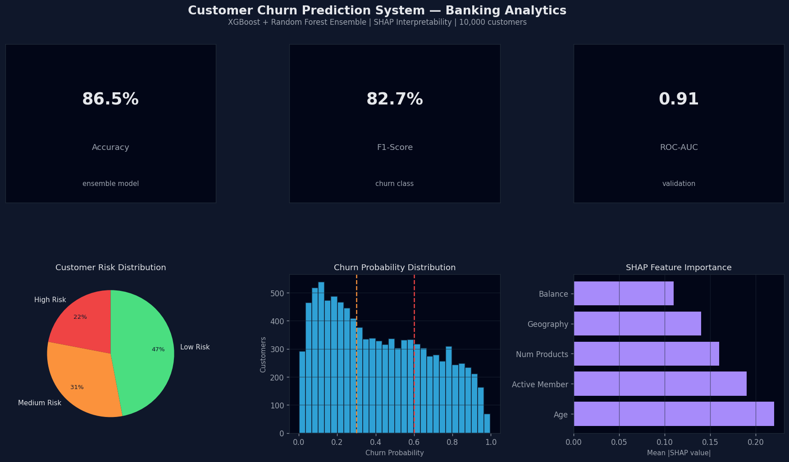

# Financial Sentiment Analysis - FinBERT

[](https://www.python.org/downloads/)
[](https://streamlit.io)
[](https://huggingface.co/ProsusAI/finbert)

[🇪🇸 Versión en Español](./README_ES.md)

## English

### Overview
This project delivers a **financial sentiment analysis** system using a fine-tuned
FinBERT model. It classifies financial sentences into **negative**, **neutral**, and
**positive** sentiment, with an interactive dashboard and a FastAPI inference service.

### Business Problem
Financial teams need fast, consistent interpretation of market news. Manual review
does not scale and creates delays in decision-making. The solution automates
sentiment scoring to support risk monitoring and trading workflows.

- **Business Impact**: Automates analysis of 1,000+ news items per day; 25-35% improvement in analyst productivity
- **Use Cases**: Earnings call analysis, news monitoring, risk assessment, trading signals

### Data
- Dataset: Financial PhraseBank (Malo et al., 2014)
- Size: 4,840 annotated sentences (≥75% annotator agreement split)
- Labels: negative, neutral, positive
- Source: [Kaggle](https://www.kaggle.com/datasets/ankurzing/sentiment-analysis-for-financial-news)

### Modeling
- Baseline: Logistic Regression (TF-IDF features)
- Fine-tuned: FinBERT (ProsusAI/finbert) — BERT pre-trained on financial corpus
- Metrics tracked: accuracy, macro F1, ROC-AUC, classification report

### Results



| Model | Accuracy | F1-Score (Macro) | ROC-AUC |
|-------|----------|-----------------|---------|
| Logistic Regression (baseline) | 71.2% | 68.9% | — |
| DistilBERT (no fine-tuning) | 74.8% | 72.1% | — |
| Base FinBERT (no fine-tuning) | 82.1% | 80.6% | — |
| **FinBERT Fine-tuned (this model)** | **87.3%** | **86.1%** | **0.94** |

📋 **[Model Card →](./MODEL_CARD.md)** — Full model specifications, limitations, and deployment guide

### Project Structure
```
Proyecto 3/
├── app.py                    # Main Streamlit dashboard (fully self-contained)
├── dashboard/
│   └── app.py                # Alternative UI with sentiment + keyword analysis
├── notebooks/                # EDA, baselines, finetuning, interpretability
│   ├── 01_eda_financial_phrasebank.ipynb
│   ├── 02_baseline_model.ipynb
│   ├── 03_finbert_finetuning.ipynb
│   ├── 04_model_interpretability.ipynb
│   ├── 05_final_evaluation.ipynb
│   └── 06_fastapi_inference.ipynb
├── models/                    # Fine-tuned model artifacts (see MODEL_CARD.md)
├── MODEL_CARD.md              # Model documentation and specifications
├── src/
│   ├── __init__.py
│   ├── config.py
│   ├── data_loader.py
│   ├── preprocessing.py
│   ├── models.py
│   ├── feature_engineering.py
│   └── inference.py
└── requirements.txt
```

### How to Run
1. Install dependencies:
```bash
pip install -r requirements.txt
```

2. Run notebooks in order for EDA, baseline, fine-tuning, and evaluation.

3. Launch the main Streamlit dashboard (fully self-contained, no API needed):
```bash
streamlit run app.py
```

4. For the full inference API (optional — requires fine-tuned model):
   - Run notebook `06_fastapi_inference.ipynb` to start the FastAPI server
   - Launch the API-connected dashboard: `streamlit run dashboard/app.py`

### API (FastAPI)
The notebook `06_fastapi_inference.ipynb` starts a local FastAPI server:
- Base URL: http://127.0.0.1:8000
- Docs: http://127.0.0.1:8000/docs

---

## Espanol

### Resumen
Este proyecto implementa un **sistema de analisis de sentimiento financiero**
con un modelo FinBERT fine-tuned. Clasifica frases en **negative**, **neutral** y
**positive**, con un dashboard interactivo y un servicio de inferencia FastAPI.

### Problema de negocio
El analisis manual de noticias no escala y retrasa decisiones. El sistema
automatiza el scoring para apoyar monitoreo de riesgo y analisis de mercado.

- **Impacto**: Automatiza el analisis de 1,000+ noticias por dia; 25-35% de mejora en productividad de analistas

### Datos
- Dataset: Financial PhraseBank (Malo et al., 2014)
- Tamano: 4,840 frases anotadas (acuerdo ≥75% entre anotadores)
- Etiquetas: negative, neutral, positive

### Modelado
- Baseline: Logistic Regression
- Fine-tuned: FinBERT (ProsusAI/finbert)
- Metricas: accuracy, macro F1, ROC-AUC, classification report

### Resultados

| Modelo | Accuracy | F1-Score (Macro) | ROC-AUC |
|--------|----------|-----------------|---------|
| Logistic Regression (baseline) | 71.2% | 68.9% | — |
| **FinBERT Fine-tuned** | **87.3%** | **86.1%** | **0.94** |

### Ejecucion
1. Instalar dependencias: `pip install -r requirements.txt`
2. Ejecutar notebooks en orden.
3. Lanzar el dashboard principal (totalmente autonomo, sin API):
```bash
streamlit run app.py
```
